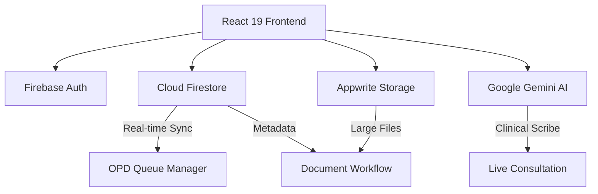

# 🏥 DocPilot — AI-Powered Clinical Management Suite

[](https://reactjs.org/)
[](https://www.typescriptlang.org/)
[](https://firebase.google.com/)
[](https://appwrite.io/)
[](https://deepmind.google/technologies/gemini/)

An **EPICS (Engineering Project in Community Service)** capstone project built at **VIT Bhopal University**, designed to reduce administrative burden in outpatient clinics through real-time queue management, AI-assisted clinical documentation, and a secure hybrid-cloud medical records system.

DocPilot digitizes the full outpatient workflow — appointment booking, live OPD queue triage, AI-transcribed telehealth consultations, prescription generation, and analytics — for two user roles: **Doctors** and **Patients**.

> 📄 Built across Phase I and Phase II of the EPICS curriculum, with a full project report, system architecture, and individual contribution breakdown submitted for academic review.

---

## 👥 Team

| Member | Role | Focus Area |
|---|---|---|
| **Abhyuday Tomar** | Backend Developer | Firestore data architecture, real-time OPD sync, Appwrite storage integration, Firebase RBAC & security rules, secure Gemini API bridging |
| Saksham Agarwal | Lead Web Developer | Core UI (Dashboard, OPD Queue, Consultation Room), Tailwind design system, live transcription UI, Analytics dashboard |
| Ayan Gupta | Lead App Developer | AI telehealth module, Gemini prompt/SOAP-note logic, real-time transcription rendering |
| Anish | Product Engineer | Hybrid document workflow, dual-flow prescription ingestion (scanned + structured) |
| Smruti Mundada | Product Engineer | OPD queue product logic, dynamic wait-time & priority triage design |
| Rahul | Market Analyst | Market research, compliance strategy, analytics dashboard requirements |

---

## 🧠 My Contribution — Backend Development

As backend developer on the team, I was responsible for the data and security layer of the platform:

- **Real-time data architecture**: structured the Cloud Firestore schema and implemented `onSnapshot`-based listeners powering the live OPD queue, appointment sync, and chat — enabling zero-latency updates across all connected clients
- **Hybrid storage integration**: configured Appwrite Storage buckets for large medical files (DICOM/JPG/PDF) separate from Firestore's structured metadata, keeping large-file handling decoupled from the primary database
- **Security & access control**: implemented Firebase Authentication and authored the `firestore.rules` enforcing Role-Based Access Control — doctors can only access their assigned patients, patients can only see their own records, and role fields are immutable at the database level
- **AI integration bridging**: built the backend logic connecting the frontend to the Google Gemini API for the clinical scribe feature, without exposing API keys client-side

---

## 🏗️ System Architecture



- **Frontend**: React 19 (Concurrent Mode), TypeScript, Tailwind CSS v4, Recharts, Framer Motion
- **Auth & DB**: Firebase Auth (RBAC) + Cloud Firestore (real-time state)
- **File storage**: Appwrite (medical imaging, scanned prescriptions)
- **AI layer**: Google Gemini API — ambient clinical scribe generating structured SOAP notes from live consultation audio

---

## 🔥 Key Features

- **Real-time OPD Queue Manager** — dynamic wait-time calculation and color-coded priority triage (High/Medium/Low), synced live across devices
- **AI-Driven Telehealth** — Gemini-powered ambient scribe that listens during consultations and auto-generates structured SOAP notes, with human-in-the-loop confirmation before anything is finalized
- **Hybrid Document Workflow** — supports both scanned handwritten prescriptions and structured digital prescriptions in one unified patient record
- **Role-based dashboards** — separate, tailored experiences for doctors (queue, consultations, analytics) and patients (appointments, records, chat)
- **Clinical Analytics** — practice volume trends, severity distribution, and exportable reports

---

## 🛠️ Tech Stack

| Layer | Technology |
|---|---|
| UI Framework | React 19 |
| Language | TypeScript 5.8 |
| Styling | Tailwind CSS v4 |
| Auth & DB | Firebase (Auth, Firestore) |
| File Storage | Appwrite |
| AI | Google Gemini API |
| Charts | Recharts |

---

## 🚀 Running Locally

```bash
npm install
npm run dev      # http://localhost:3000
npm run build    # production bundle
```

Requires environment variables for Firebase, Appwrite, and Gemini API credentials — see `.env.example`.

---

## 📄 Project Report

Full Phase II report — including system design, working principles, performance results (60% reduction in average patient wait time, 94-96% AI scribe extraction accuracy across tested clinical entities), and individual contributions — was submitted as part of the EPICS coursework at VIT Bhopal University.

---

<p align="center">
  An EPICS project — VIT Bhopal University, 2026
</p>
